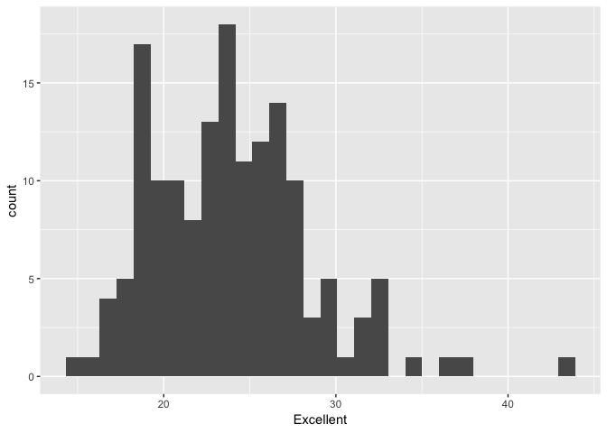
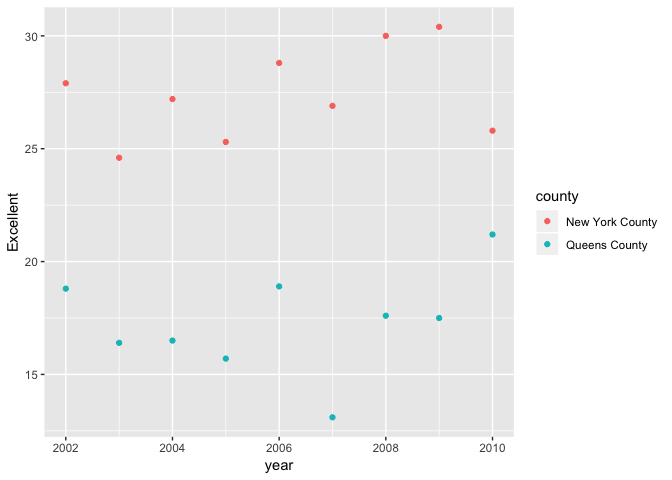

p8105\_hw2\_ag3911
================

# Problem 1: NYC Subway Transit

## Read and Clean Data

*Keep line, station, name, station latitude/longitude, routes served,
entry, vending, entrance type, and ADA compliance *Convert entry
variable from character (yes/no) to logical

``` r
library(tidyverse)
getwd()
```

    ## [1] "/Users/ameliaga/Documents/MPH Sem 3/Data Science/p8105_hw2_ag3911/p8105_hw2_ag3911"

``` r
subway_data = read_csv("./hw2 data/NYC_Transit_Subway_Entrance_And_Exit_Data.csv") %>%
  janitor::clean_names() %>%
  select(-division, -exit_only, -staffing, -staff_hours, -ada_notes, -entrance_location, -entrance_longitude, -entrance_latitude, -station_location, -corner, -east_west_street, -north_south_street, -free_crossover) %>%
  mutate(entry = recode(entry, "YES" = TRUE, "NO" = FALSE))
subway_data
```

    ## # A tibble: 1,868 x 19
    ##    line  station_name station_latitude station_longitu… route1 route2
    ##    <chr> <chr>                   <dbl>            <dbl> <chr>  <chr> 
    ##  1 4 Av… 25th St                  40.7            -74.0 R      <NA>  
    ##  2 4 Av… 25th St                  40.7            -74.0 R      <NA>  
    ##  3 4 Av… 36th St                  40.7            -74.0 N      R     
    ##  4 4 Av… 36th St                  40.7            -74.0 N      R     
    ##  5 4 Av… 36th St                  40.7            -74.0 N      R     
    ##  6 4 Av… 45th St                  40.6            -74.0 R      <NA>  
    ##  7 4 Av… 45th St                  40.6            -74.0 R      <NA>  
    ##  8 4 Av… 45th St                  40.6            -74.0 R      <NA>  
    ##  9 4 Av… 45th St                  40.6            -74.0 R      <NA>  
    ## 10 4 Av… 53rd St                  40.6            -74.0 R      <NA>  
    ## # ... with 1,858 more rows, and 13 more variables: route3 <chr>,
    ## #   route4 <chr>, route5 <chr>, route6 <chr>, route7 <chr>, route8 <int>,
    ## #   route9 <int>, route10 <int>, route11 <int>, entrance_type <chr>,
    ## #   entry <lgl>, vending <chr>, ada <lgl>

This dataset contains the following variables: line, station name,
station latitude/longitude, which of the 11 routes are served, entry
(true/false), vending (yes/no), entrance type (elevator, stair, door),
and ADA compliance (true/false). I omitted unnecessary variables using
‘select’ and recoded the entry variable from character to logical
using ‘mutate’ and ‘recode’. The resulting dataset is 1,868 rows x 19
columns. The data are not tidy because there are 11 variables for route
when there should only be 2: one for the total number of routes and one
for the route’s identifying letter/number.

## Q1: How many distinct stations are there?

``` r
nrow(distinct(subway_data, station_name, line))
```

    ## [1] 465

There are 465 distinct stations.

## Q2: How many distinct stations are ADA compliant?

``` r
subway_data %>%
    count(station_name, line, ada) %>% #selecting distinct stations
    filter(ada == "TRUE") %>% #filtering for ADA compliance
    summarise(n = n())
```

    ## # A tibble: 1 x 1
    ##       n
    ##   <int>
    ## 1    84

84 stations are ADA
compliant.

## Q3: What proportion of station entrances / exits without vending allow entrance?

``` r
vending = filter(subway_data, vending == "NO")
mean(vending$entry == "TRUE")
```

    ## [1] 0.3770492

37.7% of station entrances/exits without vending allow
entrance.

## Reformat data so that route number and route name are distinct variables

## Q4: After reformatting the data so that route number and route name are distinct variables, how many distinct stations serve the A train?

``` r
tidy_subway_data = gather(subway_data, key = route_num, value = route_name, route1:route11)
# how to do this with nested %>% code? also, can't I now delete the route_num bc seems to have no purpose? 
tidy_subway_data
```

    ## # A tibble: 20,548 x 10
    ##    line  station_name station_latitude station_longitu… entrance_type entry
    ##    <chr> <chr>                   <dbl>            <dbl> <chr>         <lgl>
    ##  1 4 Av… 25th St                  40.7            -74.0 Stair         TRUE 
    ##  2 4 Av… 25th St                  40.7            -74.0 Stair         TRUE 
    ##  3 4 Av… 36th St                  40.7            -74.0 Stair         TRUE 
    ##  4 4 Av… 36th St                  40.7            -74.0 Stair         TRUE 
    ##  5 4 Av… 36th St                  40.7            -74.0 Stair         TRUE 
    ##  6 4 Av… 45th St                  40.6            -74.0 Stair         TRUE 
    ##  7 4 Av… 45th St                  40.6            -74.0 Stair         TRUE 
    ##  8 4 Av… 45th St                  40.6            -74.0 Stair         TRUE 
    ##  9 4 Av… 45th St                  40.6            -74.0 Stair         TRUE 
    ## 10 4 Av… 53rd St                  40.6            -74.0 Stair         TRUE 
    ## # ... with 20,538 more rows, and 4 more variables: vending <chr>,
    ## #   ada <lgl>, route_num <chr>, route_name <chr>

``` r
tidy_subway_data %>%
    count(station_name, line, route_name) %>%
    filter(route_name == "A") %>%
    summarise(n = n())
```

    ## # A tibble: 1 x 1
    ##       n
    ##   <int>
    ## 1    60

There are 60 distinct stations that serve the A
train.

## Q5: After reformatting the data so that route number and route name are distinct variables, of the distinct stations that serve the A train, how many are ADA compliant?

``` r
tidy_subway_data %>%
    count(station_name, line, route_name, ada) %>%
    filter(route_name == "A") %>%
    filter(ada == "TRUE") %>%
    summarise(n = n())
```

    ## # A tibble: 1 x 1
    ##       n
    ##   <int>
    ## 1    17

Of the stations that serve the A train, 17 are ADA compliant.

# Problem 2: Mr. Trashwheel

## Read and Clean Mr. Trashwheel Sheet Data

*specify the sheet in the Excel file *omit columns containing notes
*omit rows that do not include dumpster-specific data *round the number
of sports balls to the nearest integer and convert the result to an
integer variable (using as.integer)

``` r
library(readxl)
trash_data = readxl::read_excel("./hw2 data/HealthyHarborWaterWheelTotals2017-9-26.xlsx", sheet = "Mr. Trash Wheel", range = cell_cols(1:14)) %>%
  janitor::clean_names() %>%
  filter(dumpster != "NA" & dumpster != 23220) %>%
  mutate(sports_balls = as.integer(sports_balls)) 
```

## Read and Clean 2016 and 2017 Precipitation Sheets Data

*omit rows without precipitation data and add a variable year *combine
datasets and convert month to a character variable, use the variable
‘month.name’

``` r
precip_16_data = readxl::read_excel("./hw2 data/HealthyHarborWaterWheelTotals2017-9-26.xlsx", sheet = "2016 Precipitation", skip = 2, col_names = FALSE) %>%
  janitor::clean_names() %>%
  rename(month = x_1, total_precip = x_2) %>%
  filter(month != "NA", total_precip != "NA") %>%
  mutate(year = 16) 
  
precip_17_data = readxl::read_excel("./hw2 data/HealthyHarborWaterWheelTotals2017-9-26.xlsx", sheet = "2017 Precipitation", skip = 2, col_names = FALSE) %>%
  janitor::clean_names() %>%
  rename(month = x_1, total_precip = x_2) %>%
  mutate(year = 17) %>%
  filter(month != "NA", total_precip != "NA")

#This is the less tidy but more useful presentation of the data: 
precip_joined = left_join(precip_17_data, precip_16_data, by = "month") %>%
  mutate(month = month.name[month]) %>%
  rename(total_precip_17 = total_precip.x) %>%
  rename(total_precip_16 = total_precip.y) %>%
  select(-year.x, -year.y)

#This is the tidier (although less visually pleasing) way to organize the data:
precip_bind = bind_rows(precip_17_data, precip_16_data) %>%
  mutate(month = month.name[month]) 

precip_bind %>%
    filter(year == 17) %>%
    summarize(sum(total_precip))
```

    ## # A tibble: 1 x 1
    ##   `sum(total_precip)`
    ##                 <dbl>
    ## 1                29.9

### In a paragraph (use inline R), note the number of observations in both resulting datasets, and give examples of key variables. For available data, what was the total precipitation in 2017? What was the median number of sports balls in a dumpster in 2016?

The edited trash dataset has dimensions 215, 14. The joined and edited
precipitation dataset has dimensions 20, 3. The total precipitation in
2017 was 29.93. The median of number of sports balls in a dumpster in
2016 was
13.

# Problem 3: Behavioral Risk Factors Surveillance System (BRFSS) for Selected Metropolitan Area Risk Trends (SMART), 2002-2010

## Read and Clean BRFSS data

*format the data to use appropriate variable names *exclude variables
for class, topic, question, sample size, and everything from lower
confidence limit to GeoLocation *structure data so that responses
(excellent to poor) are variables taking the value of Data\_value
*create a new variable showing the proportion of responses that were
“Excellent” or “Very Good”

``` r
#install.packages("devtools", force = TRUE)
devtools::install_github("p8105/p8105.datasets")
```

    ## Skipping install of 'p8105.datasets' from a github remote, the SHA1 (21f5ad1c) has not changed since last install.
    ##   Use `force = TRUE` to force installation

``` r
library(p8105.datasets)
library(tidyverse)
brfss <- brfss_smart2010 %>%
  janitor::clean_names() %>%
  select(year, locationdesc, topic, response, data_value) %>%
  filter(topic == "Overall Health") %>% 
  select(-topic) %>%
  rename("Overall Health Score" = data_value) %>%
  separate(locationdesc, into = c("state", "county"), sep = " - ") %>% #instead of keeping     locationabbr, separate locationdesc into two columns: one with state and one with county 
  spread(key = response, value = "Overall Health Score")

brfss$ex_or_vg_prop = brfss$`Very good` + brfss$Excellent

#brfss$ex_or_vg_num =  brfss$`Very good` +  brfss$Excellent #calculate numerator (the sum of very good or excellent responses)
#brfss$ex_or_vg_denom = sum(brfss$Excellent: brfss$`Very good`) #calculate denominator (the sum of all responses)
#brfss$prop = brfss$ex_or_vg_num/brfss$ex_or_vg_denom
```

## Q1: How many unique locations are included in the dataset?

``` r
length(unique(brfss$county))
```

    ## [1] 351

There are 351 unique locations.

## Q2: Is every state represented?

``` r
length(unique(brfss$state))
```

    ## [1] 51

Yes. There are 51 states represented, including Washington D.C.

## Q3: What state is observed the most?

``` r
table(brfss$state)
```

    ## 
    ##  AK  AL  AR  AZ  CA  CO  CT  DC  DE  FL  GA  HI  IA  ID  IL  IN  KS  KY 
    ##  11  18  21  32  52  59  47   9  27 122  27  31  14  32  25  21  38   9 
    ##  LA  MA  MD  ME  MI  MN  MO  MS  MT  NC  ND  NE  NH  NJ  NM  NV  NY  OH 
    ##  45  79  90  31  34  33  25  23  18 115  18  53  48 146  43  18  65  59 
    ##  OK  OR  PA  RI  SC  SD  TN  TX  UT  VA  VT  WA  WI  WV  WY 
    ##  40  33  59  38  63  18  26  71  50   4  48  97   9   9  22

New Jersey is observed the most with 146 observations.

## Q4: In 2002, what is the median of the “Excellent” response value?

``` r
brfss_02 = filter(brfss, year == '2002') 
median(brfss_02$Excellent, na.rm = TRUE)
```

    ## [1] 23.6

The median of the “Excellent” responses is
    23.6.

## Q5: Make a histogram of “Excellent” response values in the year 2002.

``` r
ggplot(brfss_02, aes(x = Excellent)) + geom_histogram()
```

    ## `stat_bin()` using `bins = 30`. Pick better value with `binwidth`.

    ## Warning: Removed 2 rows containing non-finite values (stat_bin).

<!-- -->

## Q6: Make a scatterplot showing the proportion of “Excellent” response values in New York County and Queens County (both in NY State) in each year from 2002 to 2010.

``` r
#brfss$ex_prop = brfss$Excellent/sum(brfss$Excellent:brfss$`Very good`) 
brfss_NY_state = filter(brfss, state == "NY")
brfss_NYC_Queens = filter(brfss_NY_state, county == "New York County" | county == "Queens County")

ggplot(brfss_NYC_Queens, aes(x = year, y = Excellent)) + geom_point()
```

<!-- -->
